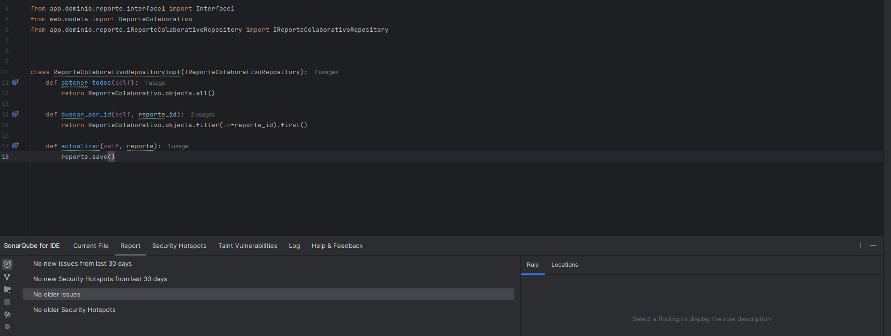

# 📌 Traffic Pulse - Estilos de Programación Aplicados - Laboratorio 10

Este documento resume los estilos de programación aplicados en la implementación del módulo de gestión y edición de reportes colaborativos, correspondiente al proyecto final del curso.

## Autor

- Nombre: David A. Espinoza B.
- Módulo trabajado: Control y edición de reportes (Panel administrador)

---

## Estilos de Programación Aplicados

### 1. Pipeline Style

**Descripción:**  
El estilo pipeline se aplica al organizar el flujo de una función como una secuencia de pasos claramente definidos y consecutivos. En la vista `editar_reporte`, los datos fluyen desde la obtención del ID, pasando por validaciones, recuperación del objeto, procesamiento del formulario, validación de campos y actualización. Cada etapa se ejecuta de forma secuencial, lo que hace que el flujo de datos sea predecible y mantenible.

**Fragmento utilizado:**

### 2. Things Style

**Descripción:** Este estilo se basa en modelar el sistema a partir de “cosas” u objetos con responsabilidades específicas. En este proyecto se refleja en la implementación de un patrón de capas (Repository → ApplicationService → Controller), donde cada clase representa una unidad coherente de lógica de negocio o acceso a datos. Esto mejora la escalabilidad y facilita el mantenimiento del sistema.

**Fragmento utilizado:**

### 3. Exception Handling

**Descripción:** Este estilo se aplica al gestionar errores potenciales mediante bloques try-except, evitando que la aplicación se detenga abruptamente. En este caso, si el ID ingresado por el usuario no es válido, el sistema captura la excepción, muestra un mensaje y continúa funcionando correctamente. Esto mejora la experiencia de usuario y la estabilidad del sistema.

**Fragmento utilizado:**

### 4. Persistent-Tables Style

**Descripción:** Se utiliza un repositorio para actualizar los datos persistentes en una base de datos mediante el ORM de Django. Esta lógica abstrae el almacenamiento, permitiendo modificar registros sin acoplar directamente la lógica de negocio con el modelo de datos. Esta separación favorece la reutilización de código y el cumplimiento de principios SOLID.

**Fragmento utilizado:**

