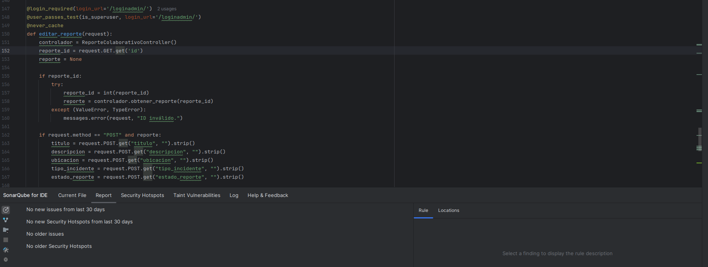
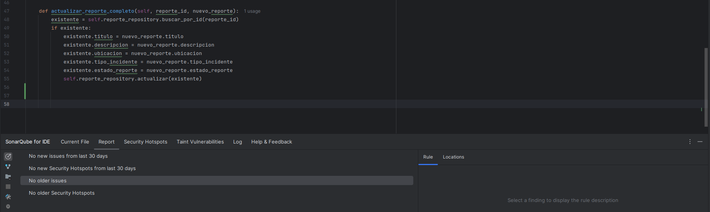

# 📌 Traffic Pulse - Estilos de Programación Aplicados - Laboratorio 10

Este documento resume los estilos de programación aplicados en la implementación del módulo de gestión y edición de reportes colaborativos, correspondiente al proyecto final del curso.

## Autor

- Nombre: David A. Espinoza B.
- Módulo trabajado: Control y edición de reportes (Panel administrador)

---

## Estilos de Programación Aplicados

### 1. Pipeline Style

**Descripción:**  
El estilo pipeline se aplica al organizar el flujo de una función como una secuencia de pasos claramente definidos y consecutivos. En la vista `editar_reporte`, los datos fluyen desde la obtención del ID, pasando por validaciones, recuperación del objeto, procesamiento del formulario, validación de campos y actualización. Cada etapa se ejecuta de forma secuencial, lo que hace que el flujo de datos sea predecible y mantenible.

**Fragmento utilizado:**

### 2. Things Style

**Descripción:** Este estilo se basa en modelar el sistema a partir de “cosas” u objetos con responsabilidades específicas. En este proyecto se refleja en la implementación de un patrón de capas (Repository → ApplicationService → Controller), donde cada clase representa una unidad coherente de lógica de negocio o acceso a datos. Esto mejora la escalabilidad y facilita el mantenimiento del sistema.

**Fragmento utilizado:**

### 3. Exception Handling

**Descripción:** Uso explícito del manejo de errores para evitar interrupciones por entradas inválidas.

**Fragmento:**

### 4. Persistent-Tables Style

**Descripción:** Uso del ORM de Django para mapear objetos a tablas persistentes.

**Fragmento:**

