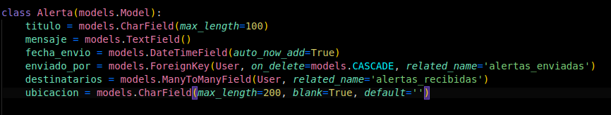
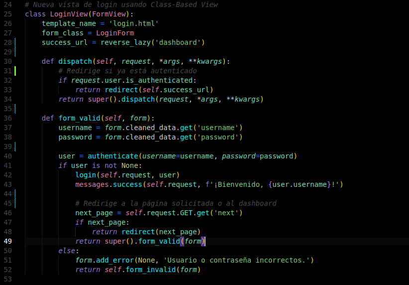
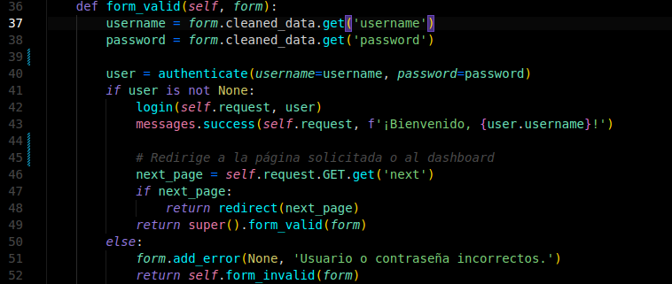
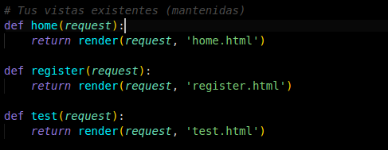

# 🧪 Laboratorio 11 – Clean Code

## 📋 Tarea
Demostrar y corregir **Problemas de codigo** en el proyecto final, aplicando prácticas de codificación legible (Clean Code) para facilitar su lectura.

## ✅ Actividades realizadas
- Correcion de malas practicas y/o errores de codigo en: Nombres, Funciones, Comentarios, Estructura de Código, Objetos/Estructuras de Datos, Manejo de Errores y Clases.
- Corrección usando **SonarLint**.

---

## 🌟 Prácticas aplicadas

### 1. **Nombres descriptivos y buscables**  
> Problemas al no ser precisos ni descriptivo con el nombre de mis variables o funciones

```python
# [ANTES] 
class Alerta(models.Model):
    name = models.CharField(max_length=100)
    msg = models.TextField()
    time01 = models.DateTimeField(auto_now_add=True)
    user01 = models.ForeignKey(User, on_delete=models.CASCADE, related_name='alertas_enviadas')
    user02 = models.ManyToManyField(User, related_name='alertas_recibidas')
    ubi = models.CharField(max_length=200, blank=True, default='')
```
Ahora:




### 2. **Comentarios utiles**
> Los comentarios fueron corregidos para aportar un mensaje de valor de forma clara

```python
# [ANTES]
# login
class LoginView(FormView):
    template_name = 'login.html'
    form_class = LoginForm
    success_url = reverse_lazy('dashboard')  #success
    
    def dispatch(self, request, *args, **kwargs):   #autentification
        if request.user.is_authenticated:
            return redirect(self.success_url)
        return super().dispatch(request, *args, **kwargs)
    
    def form_valid(self, form):                     #login
        username = form.cleaned_data.get('username')
        password = form.cleaned_data.get('password')
        
        user = authenticate(username=username, password=password)
        if user is not None:
            login(self.request, user)
            messages.success(self.request, f'¡Bienvenido, {user.username}!')
            
            # Dashboar check
            next_page = self.request.GET.get('next')
            if next_page:
                return redirect(next_page)
            return super().form_valid(form)
        else:
            form.add_error(None, 'Usuario o contraseña incorrectos.')
            return self.form_invalid(form)
```
Ahora:




### 3. **Eliminar redundancias (DRY)**
> Se corrigio varias redundancias innecesarias

```python
# [ANTES]
def form_valid(self, form):
    username = form.cleaned_data.get('username')
    password = form.cleaned_data.get('password')
    
    user = authenticate(username=username, password=password)
    if user is not None:
        # ...
        return redirect(self.request.GET.get('next') or super().form_valid(form))
    else:
        # Error: duplicación de acceso a cleaned_data
        username2 = form.cleaned_data.get('username')
        password2 = form.cleaned_data.get('password')
        form.add_error(None, f'Credenciales incorrectas: {username2}/{password2}')
        return self.form_invalid(form)
```

Ahora:




### 4. **Funciones breves**
> Se modularizo las funciones para evitar que sean tediosas de leer y gane independencia.

> Se corrigio varias redundancias innecesarias

```python
# [ANTES]
def main_view(request, action=None):
    # Demasiadas responsabilidades en una sola función
    if action == 'home':
        return render(request, 'home.html')
    elif action == 'register':
        return render(request, 'register.html')
    elif action == 'test':
        return render(request, 'test.html')
    else:
        return redirect('home')
```

Ahora:



