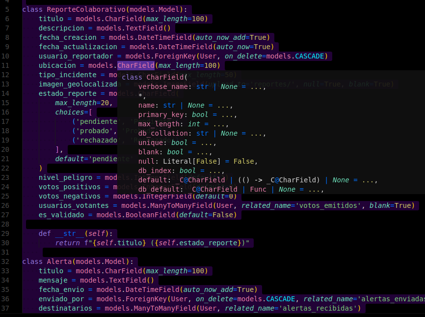
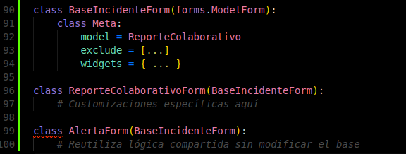
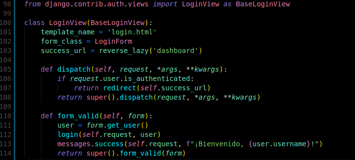
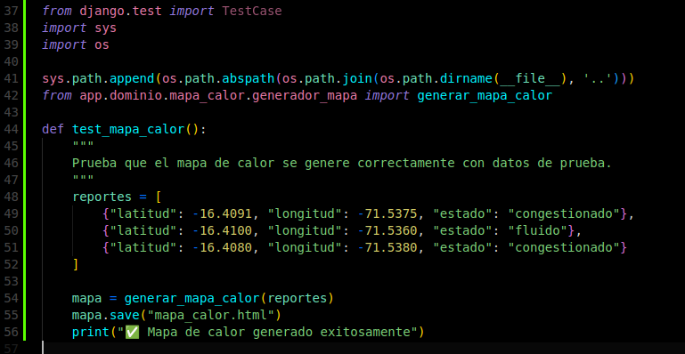

# 🧩 Laboratorio 12 – Principios SOLID

## 🎯 Tarea
Aplicar al menos **3 principios SOLID** en el proyecto de trabajo final.

## ✅ Principios aplicados

### 1. Single Responsibility Principle (SRP)
Cada clase debe tener una sola responsabilidad o motivo de cambio.



### 2. Open/Closed Principle (OCP)
El principio OCP establece que una clase debe estar abierta a la extensión, pero cerrada a la modificación

```python
#Error
class RegistroUsuarioForm(UserCreationForm):
    email = forms.EmailField(required=True, widget=forms.EmailInput(attrs={
        'class': FORM_CONTROL,
        'placeholder': 'Correo electrónico',
        'id': 'email',
    }))
    .
    .
    .
```



### 3. Liskov Substitution Principle (LSP)
requiere que cualquier subclase pueda utilizarse en lugar de la clase base sin alterar el comportamiento del programa.


### 4. Dependency Inversion Principle (DIP)
Para aplicar el DIP, introducimos una capa de abstracción que permita que el código de prueba dependa de una interfaz en lugar de una implementación concreta.



