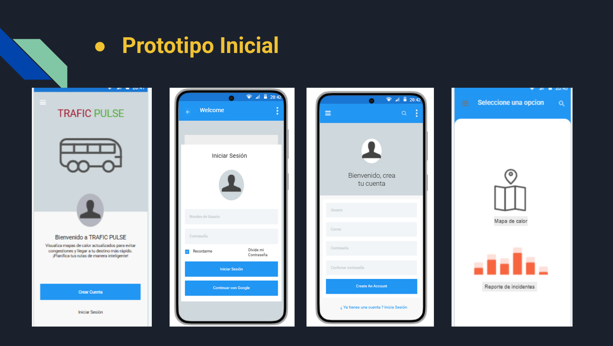
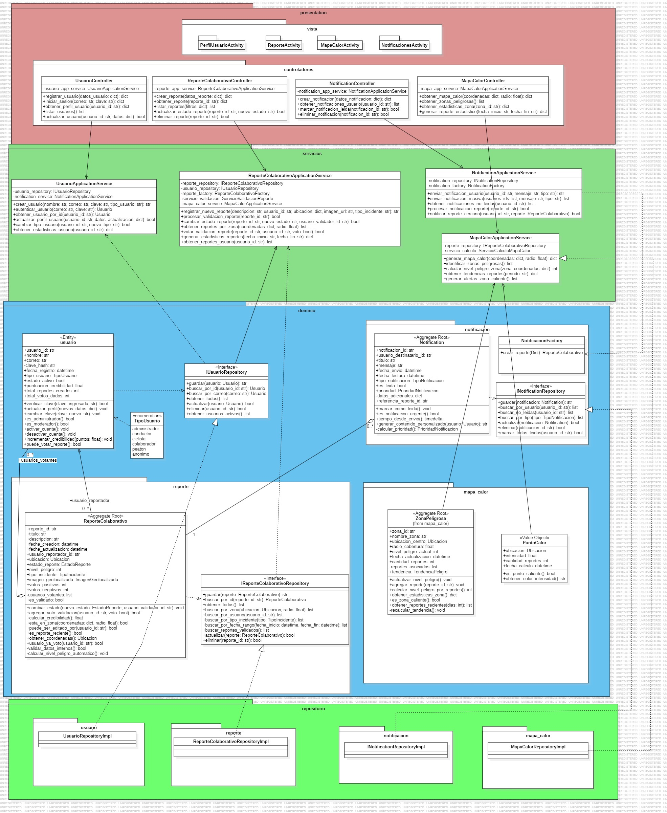

# 🌐 Mapa Interactivo Colaborativo

El presente proyecto tiene como objetivo aprender sobre el desarrollo de software con tecnologias moderdas explorando arquitecturas de software, frameworks, DDD, Herramientas de desarrollo agil y demas que estan detalladas en el presente. El proyecto es grupal y su objetivo es conectar personas mediante un **mapa de calor en línea** y **Sistema de reportes**, permitiendo la interacción y colaboración en tiempo real.

---

## 📌 Propósito

El propósito de este software es brindar una **plataforma online** donde los usuarios puedan:
- Analizar un mapa de calor para poder evitar ciertas zonas de alto transito.
- Compartir ubicaciones, comentarios o información sobre posibles incidencias que perjudiquen el trafico.
- Colaborar en tiempo real con otros usuarios conectados.
- Potenciar actividades sociales como el ciclismo o la exploracion de rutas alternativas.

---

## 🚀 Funcionalidades

### 🔹 Funcionalidades de Alto Nivel
A continuación, se presenta el **Diagrama de Casos de Uso UML** que representa las principales interacciones del usuario con el sistema:

**Usuario**
- Ver y navegar el mapa
- Iniciar sesion
- Reportar estado del trafico
- Consultar mapa de trafico
- Actualizar perfil
- Filtrar reportes por zona
- Recibir notificaciones de trafico
**Administrador**
- Gestionar usuarios
- Moderar reportes
- Generar estadisticas
- Configurar zonas de la ciudad
- Eliminar reportes inapropiados

### 🔸 Prototipo / GUI

Visual de la interfaz de usuario o boceto inicial del sistema:

---

## 🧠 Modelo de Dominio

### 🧩 Diagrama de Clases UML

Representación de las principales entidades y sus relaciones dentro del sistema:

### 📦 Módulos

- `MapaInteractivo`: manejo del mapa y sus capas.
- `Usuario`: autenticación, datos y preferencias.
- `Comunicacion`: chat y mensajería en tiempo real.
- `BaseDeDatos`: acceso a datos geoespaciales.
- `InterfazWeb`: componentes y vista frontend.

---

## 🏗️ Vista General de Arquitectura

### 📁 Diagrama de Paquetes

Distribución de los módulos del sistema:

(hacer un diagrama del UML pero simplifcado)

### 🔧 Clases Principales

- `HeatMapController`: lógica de control del mapa.
- `UserService`: gestión de usuarios.
- `ReportManager`: controlador de mensajes en vivo.
- `MapRenderer`: renderizado visual del mapa.

---

## 👥 Equipo de Desarrollo

| Integrante        | Rol                   | Contacto              |
|-------------------|------------------------|------------------------|
| Afaro Buiza, Jesus Alberto   | Coordinador / Dev Full | jalfarob@unsa.edu.pe     |
| Carpio Paiva Cesar Gonzalo  | Frontend Developer   | ccarpiop@unsa.edu.pe                      |
| Colque Flores, Gerardo Javier   | Backend Developer      |               @unsa.edu.pe        |
| Ccolque Quispe, Anthony Criz   | Backend Developer          |              @unsa.edu.pe         |
| Cornejo Alvarez, Mauricio Andres   | Arquitecto de proyecto   |           @unsa.edu.pe            |
| Espinoza Barrios, DAvid Alejandro   | Director del proyecto / Dev Full   |            despinozab@unsa.edu.pe           |
| Yavar Guillen, Roberto Gustavo  | Documentación          |                @unsa.edu.pe       |

---

## 📄 Licencia

Este proyecto está bajo la licencia (creo q borramos esto (?)).  
Consulta el archivo `LICENSE` para más información.

---

## 🛠️ Tecnologías Utilizadas

- Lenguajes de programacion: `Python`
- Framework: `Bootstrap`
- Base de Datos: `PostgreSQL`
- APIs: `Leaflet`

### Enlace a tablero TRELLO
Enlace para visualizar como distribuimos el trabajo mediante tecnologias agiles:

visita nuestro [Trello](https://trello.com/b/VHHYqcFk/is-sistema-de-reportes-de-trafico-arequipa).
