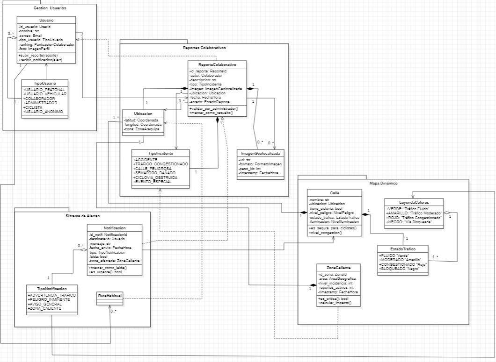
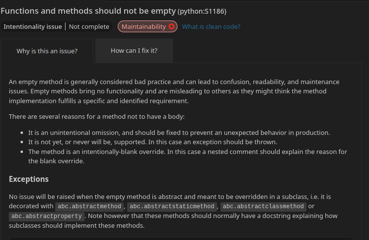
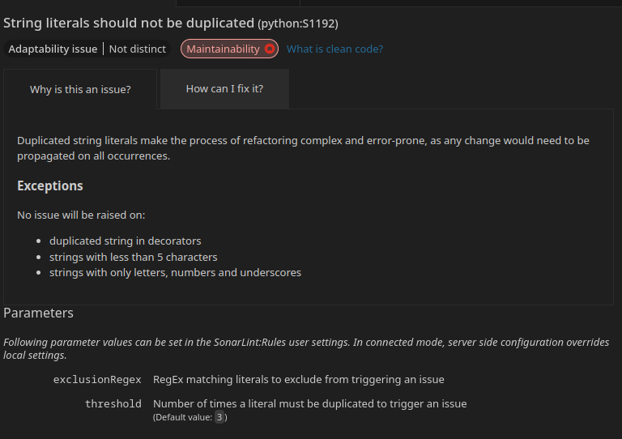

# 🌐 Mapa Interactivo Colaborativo

El presente proyecto tiene como objetivo aprender sobre el desarrollo de software con tecnologias moderdas explorando arquitecturas de software, frameworks, DDD, Herramientas de desarrollo agil y demas que estan detalladas en el presente. El proyecto es grupal y su objetivo es conectar personas mediante un **mapa de calor en línea** y **Sistema de reportes**, permitiendo la interacción y colaboración en tiempo real.

---

## 📌 Propósito

El propósito de este software es brindar una **plataforma online** donde los usuarios puedan:

- Analizar un mapa de calor para poder evitar ciertas zonas de alto transito.
- Compartir ubicaciones, comentarios o información sobre posibles incidencias que perjudiquen el trafico.
- Colaborar en tiempo real con otros usuarios conectados.
- Potenciar actividades sociales como el ciclismo o la exploracion de rutas alternativas.

---

## 🚀 Funcionalidades

### 🔹 Funcionalidades de Alto Nivel

A continuación, se presenta el **Diagrama de Casos de Uso UML** que representa las principales interacciones del usuario con el sistema:

### 🔸 Prototipo / GUI

Visual de la interfaz de usuario o boceto inicial del sistema:

---

## 🧠 Modelo de Dominio

Representación abstracta de las clases conceptuales y objetos extraídos del área en cuestión

### 🧩 Arquitectura de Capas

Representación de las principales entidades y sus relaciones dentro del sistema:

### 📦 Módulos

- `Presentacion/vista`: capa que contacta con el usuario.
- `Servicios`: capa designada a comunicar los controladores con los servicios.
- `Dominio`: Capa que contiene el entorno real de manera digitalizada.
- `Repositorio`: Conexiones con la base de datos y fuente de informacion.

---

## 🏗️ Vista General de Arquitectura

### 📐 Patrón de Diseño: MVC

La aplicación sigue la arquitectura **Modelo - Vista - Controlador (MVC)**:

- **Modelo (Model)**: Maneja la lógica de negocio y el acceso a datos.
  - Ejemplos: `User`, `Report`, `HeatMapData`.

- **Vista (View)**: Presenta los datos al usuario mediante interfaces visuales.
  - Ejemplos: Plantillas HTML para el mapa, formularios de envío de reportes.

- **Controlador (Controller)**: Recibe las peticiones del usuario, procesa la lógica y devuelve respuestas.
  - Ejemplos: `HeatMapController`, `UserController`, `ReportController`.

---

## 👥 Equipo de Desarrollo

| Integrante                        | Rol                              | Contacto                |
| --------------------------------- | -------------------------------- | ----------------------- |
| Afaro Buiza, Jesus Alberto        | Coordinador / Dev Full           | jalfarob@unsa.edu.pe    |
| Carpio Paiva Cesar Gonzalo        | Frontend Developer               | ccarpiop@unsa.edu.pe    |
| Colque Flores, Gerardo Javier     | Backend Developer                | gcolqueq@unsa.edu.pe    |
| Ccolque Quispe, Anthony Criz      | Backend Developer                | accolqueq@unsa.edu.pe   |
| Cornejo Alvarez, Mauricio Andres  | Arquitecto de proyecto           | mcornejoalv@unsa.edu.pe |
| Espinoza Barrios, DAvid Alejandro | Director del proyecto / Dev Full | despinozab@unsa.edu.pe  |
| Yavar Guillen, Roberto Gustavo    | Documentación                    | ryavarg@unsa.edu.pe     |

---

## 📄 Licencia

Este proyecto no está bajo la licencia, su proposito es educativo.  
Consulta el archivo `LICENSE` para más información.

---

## 🛠️ Tecnologías Utilizadas

- Lenguajes de programacion: `Python`, `HTML` 
- Framework: `Bootstrap`
- Base de Datos: `SQLite`
- APIs: `Leaflet`

### Enlace a tablero TRELLO

Enlace para visualizar como distribuimos el trabajo mediante tecnologias agiles:

visita nuestro [Trello](https://trello.com/b/VHHYqcFk/is-sistema-de-reportes-de-trafico-arequipa).

###

# laboratorio 12 SOLID

1. **Principio de Responsabilidad Única (SRP)**
   El modelo ReporteColaborativo tiene una única responsabilidad: representar los datos del reporte colaborativo en la base de datos. Lo mismo ocurre con el formulario ReporteColaborativoForm, que se encarga solo de la representación y validación del formulario, y no contiene lógica de negocio.

define el modelo

      class ReporteColaborativo(models.Model):

         titulo = models.CharField(max_length=100)
         descripcion = models.TextField()

         ...

         usuarios_votantes = models.ManyToManyField(User, related_name='votos_emitidos', blank=True)
         es_validado = models.BooleanField(default=False)

         def __str__(self):
            return f"{self.titulo} ({self.estado_reporte})"

define el form para el modelo

      class ReporteColaborativoForm(forms.ModelForm):
         class Meta:
            model = ReporteColaborativo
            fields = [
                  'titulo',
                  'descripcion',
                  'ubicacion',
                  'tipo_incidente',
                  'imagen_geolocalizada',
                  'nivel_peligro',
            ]
            widgets = {
                  'titulo': forms.TextInput(attrs={
                     'class': 'form-control',
                     'placeholder': 'Título del incidente'
                  }),

                  ...
            }

2.  **Principio de Abierto/Cerrado (OCP)**
    La vista ReporteIncidentView extiende CreateView, agregando nueva funcionalidad (como la geocodificación y validación personalizada) sin modificar la clase base. También se usa LoginRequiredMixin para añadir comportamiento adicional sin alterar la vista principal, cumpliendo con el principio de extensión sin modificación.

    class ReporteIncidentView(LoginRequiredMixin, CreateView):
    model = ReporteColaborativo
    form_class = ReporteColaborativoForm
    template_name = 'report_incident.html'
    success_url = reverse_lazy('dashboard')

          def form_valid(self, form):
             print("Entró al form_valid")

             lat = self.request.POST.get("latitud", "").strip()
             lng = self.request.POST.get("longitud", "").strip()
             ubicacion = self.request.POST.get("ubicacion", "").strip()

             if not (lat and lng) and not ubicacion:
                   return self.form_invalid(form)
         ...

3.  **Principio de Inversión de Dependencias (DIP)**
    La lógica que depende de un servicio externo (la API de OpenRouteService) está encapsulada en métodos separados (get_address_from_coords y get_coords_from_address), lo que desacopla el flujo principal del formulario de los detalles de implementación de la API. Esto facilita sustituir el servicio en el futuro sin alterar la lógica principal, cumpliendo con la idea de depender de abstracciones en lugar de detalles concretos.

         def get_address_from_coords(self, lat, lon):
         url = "https://api.openrouteservice.org/geocode/reverse"
         headers = {'Authorization': settings.ORS_API_KEY}
         params = {
         'point.lat': lat,
         'point.lon': lon,
         'size': 1,
         'lang': 'es'
         }

         try:
               response = requests.get(url, params=params, headers=headers)
               response.raise_for_status()
               data = response.json()
               return data["features"][0]["properties"]["label"]
         except Exception as e:
               print("Error ORS (reverse):", e)
               return None

---

# lab 11 CLEAN CODE

1.  **Nombres**
    Se aplican buenas prácticas:
    Clases como ReporteColaborativo, ReporteIncidentView, ReporteColaborativoForm usan CamelCase.
    Nombres como get_coords_from_address, form_valid, success_url son expresivos y concisos.
    En los modelos, campos como usuario_reportador, votos_positivos, imagen_geolocalizada reflejan claramente su propósito y están en snake_case.

2.  **Funciones**
    Se cumplen principios de funciones limpias:
    Las funciones get_address_from_coords y get_coords_from_address realizan una sola tarea específica.
    form_valid está ligeramente larga, pero sigue una lógica clara, con validación progresiva y sin anidar en exceso.

3.  **Comentarios**

          # Si el usuario escribió una ubicación, geocodificamos con ORS

    Este es útil y no obvio.

4.  **Estructura del Código Fuente**
    Importaciones están agrupadas y ordenadas (standard, luego Django, luego terceros, luego locales).
    Clases y funciones están bien separadas por líneas en blanco.
    La vista, el formulario y el modelo están en módulos separados, conforme al patrón de Django.

          from django.shortcuts import render
          from django.urls import reverse_lazy
          from django.views.generic.edit import CreateView
          from django.contrib import messages
          from django.contrib.auth.mixins import LoginRequiredMixin
          from django.conf import settings
          import requests

          from .models import ReporteColaborativo
          from .forms import ReporteColaborativoForm

5.  **Objetos / Estructuras de Datos**
    ReporteColaborativo y Alerta están modelados como clases Django models.Model, encapsulando datos y responsabilidades de persistencia.
    Se usa correctamente ManyToManyField para usuarios_votantes y destinatarios, lo cual refleja bien las relaciones de dominio.

6.  **Tratamiento de Errores**
    Se manejan errores correctamente con try/except:
    En get_address_from_coords y get_coords_from_address, se hace response.raise_for_status() seguido de try/except, lo cual es buena práctica.

         ...
         elif lat and lng:
            try:
                lat = float(lat)
                lng = float(lng)
                form.instance.latitud = lat
                form.instance.longitud = lng
                form.instance.ubicacion = self.get_address_from_coords(lat, lng)
            except ValueError:
                messages.error(self.request, "Coordenadas inválidas.")
                return self.form_invalid(form)

7.  **Clases**
    ReporteColaborativoForm hereda de forms.ModelForm, respetando el principio de especialización progresiva.
    ReporteIncidentView usa mixins (LoginRequiredMixin) correctamente.

         class ReporteColaborativoForm(forms.ModelForm):
            class Meta:
               model = ReporteColaborativo
               fields = [
                     'titulo',
                     'descripcion',
                     'ubicacion',
                     'tipo_incidente',
                     'imagen_geolocalizada',
                     'nivel_peligro',
               ]
               widgets = {
                     'titulo': forms.TextInput(attrs={
                        'class': 'form-control',
                        'placeholder': 'Título del incidente'
                     }),

---

# lab 10

## Estilos de programación

- Programación orientada a objetos
  - Herencia (CreateView, ModelForm, Model)
  - Encapsulación de datos (atributos del modelo)
- Estilo declarativo

  Lo usamos cuando definimos:

  - Modelos (titulo = models.CharField(...))
  - Formularios (widgets = { 'titulo': forms.TextInput(...) })
  - Templates ({{ form.as_p }} declara cómo se debe renderizar)

- Cookbook

  Lo usamos para trabajar con imagenes, declarando:

  - MEDIA_URL, MEDIA_ROOT, enctype para poder guardarlas

- Error / Exception Handling

  Django maneja automaticamente muchos errores y excepciones,
  las usamos por ejemplo para validar si el usuario esta logeado

---

# lab 9

## Convenciones y practicas en esta rama

- 4 espacios de tabulación
- Nombre de variables y funciones
  username
- Nombre de clases
  class RegistroUsuarioForm(UserCreationForm):
- Longitud de linea máximo 79 caracteres
- Evitar logica compleja
- Arquitectura MTV (Model Template View)
- Modularidad
- Agrupar apps en 'apps/' y organizar templates,static y media
- Cargar clave secreta desde '.env'
- Usar 'reverse_lazy()' en URLs y redirreciones
- Incluir requerements.txt

---

## Rerporte de Sonarqube

#### alert_method_empty

#### alert_string_duplicated

