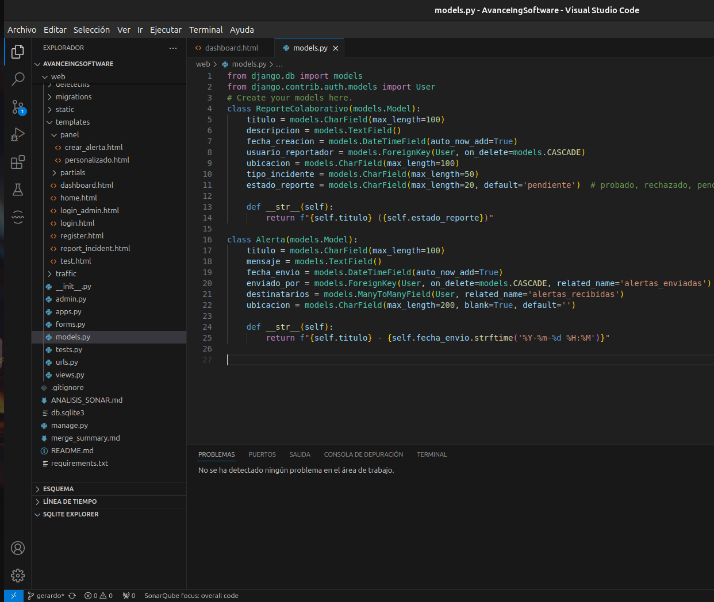
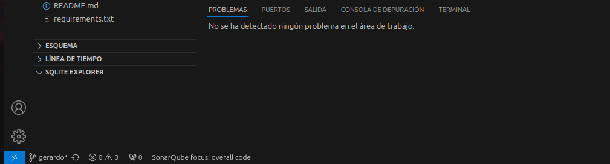
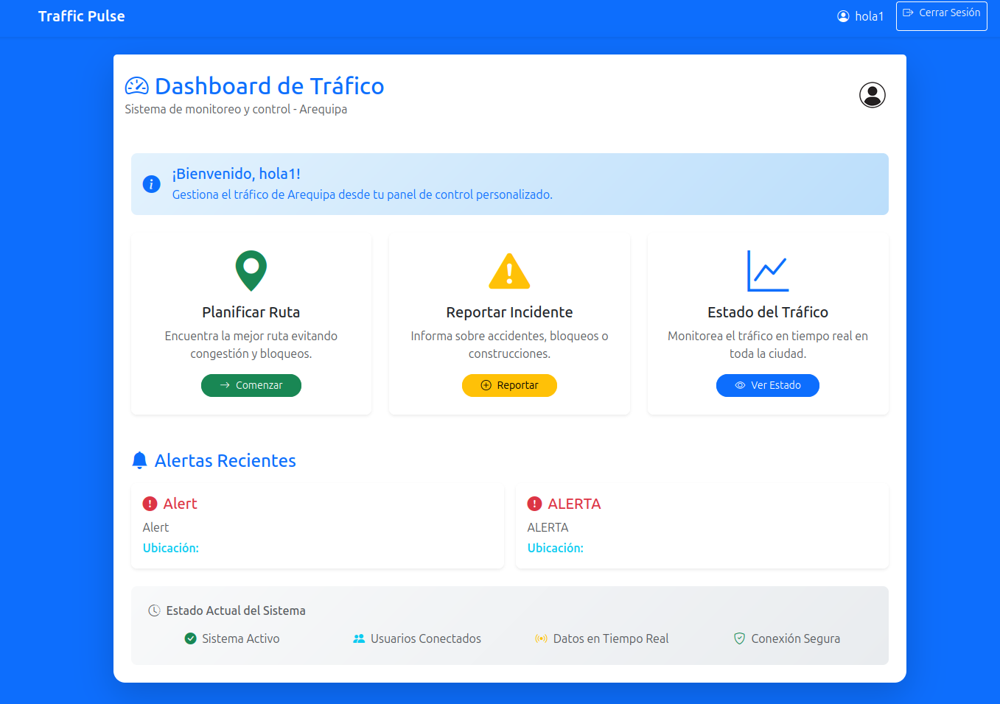
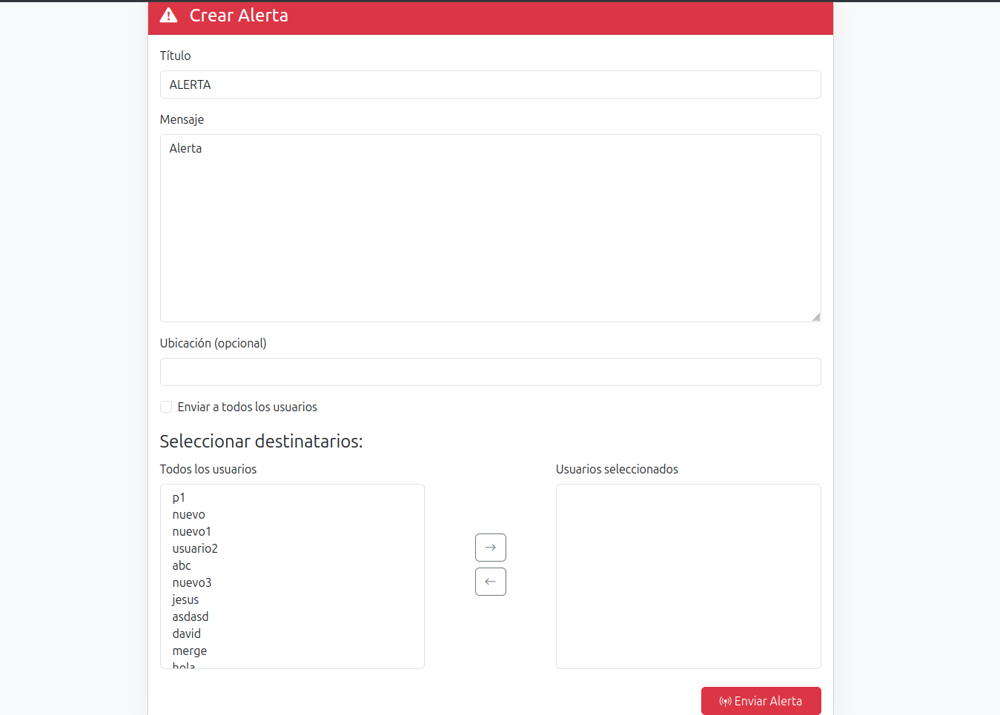
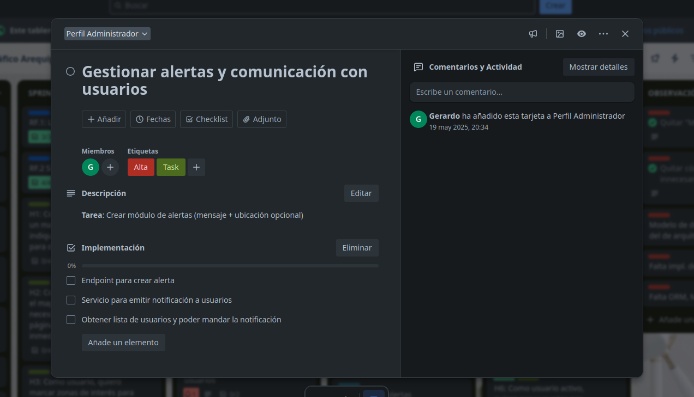

# 🚀 Lab10 - Estilos de Programación

## 🎯 Objetivo 

Aplicar estilos de programación consistentes en el módulo de alertas del proyecto **Traffic Pulse**, asegurando buena calidad de código y documentación. Se incorporaron 6 estilos de programación, se eliminaron errores con SonarLint, y se documentó todo en este archivo.

# 🚦 Traffic Pulse - Sistema de Alertas de Tráfico

💡 Traffic Pulse es un sistema web desarrollado en Django que permite la gestión de alertas de tráfico y reportes colaborativos. El sistema incluye funcionalidades para usuarios regulares y administradores, con un enfoque en la comunicación efectiva sobre incidentes de tráfico.

## 🚀 Características Principales

- **🔐 Autenticación de Usuarios y Admins**: Registro y login para usuarios y administradores
- **📊 Dashboard Personalizado**: Visualización de alertas personalizadas
- **🚨 Sistema de Alertas en Tiempo Real**: Creación y envío de alertas a usuarios específicos o todos los usuarios
- **🧑‍🤝‍🧑 Reportes Colaborativos**: Gestión de reportes de incidentes de tráfico
- **🛠️ Panel de Administración**: Control y gestión de reportes y alertas

## 🔍 Reporte de Análisis SonarQube

### ✅ Estado Final del Análisis con SonarQube

A continuación, se muestra la captura del estado final luego de corregir todos los problemas detectados por SonarLint:





> Como se observa, no se reportan errores ni advertencias en los archivos analizados.

## 🧠 Estilos de Programación Implementados

### 📁 1. **Repository Pattern (Persistent-Tables)**

Este estilo separa la lógica de acceso a datos de la lógica de negocio, proporcionando una abstracción sobre la capa de persistencia.

**Implementación:**

```python
# app/repositorio/alerta/alertaRepositoryImpl.py
from app.dominio.alerta.iAlertaRepository import IAlertaRepository

class AlertaRepositoryImpl(IAlertaRepository):
    def guardar(self, alerta):
        alerta_db = AlertaModel.objects.create(
            titulo=alerta.titulo,
            mensaje=alerta.mensaje,
            ubicacion=alerta.ubicacion,
            enviado_por=alerta.enviado_por
        )
        alerta_db.destinatarios.set(alerta.destinatarios)
        alerta_db.save()

    def obtener_por_usuario(self, usuario_id):
        return AlertaModel.objects.filter(
            destinatarios__id=usuario_id
        ).order_by('-fecha_envio')

    def listar_todas(self):
        return AlertaModel.objects.all().order_by('-fecha_envio')
```

**Beneficios:**
- Separación clara entre lógica de negocio y acceso a datos
- Facilita el testing mediante mocking
- Flexibilidad para cambiar el mecanismo de persistencia

### 🧩 2. **Dependency Injection (Things)**

Permite inyectar dependencias en lugar de crearlas dentro de las clases, mejorando la testabilidad y el acoplamiento.

**Implementación:**

```python
# app/servicios/alertaApplicationService.py
class AlertaApplicationService:
    def __init__(self, alerta_repo):
        self.alerta_repo = alerta_repo  # Dependencia inyectada

    def crear_alerta(self, titulo, mensaje, enviado_por, destinatarios, ubicacion=None):
        alerta = Alerta(titulo, mensaje, enviado_por, destinatarios, ubicacion)
        self.alerta_repo.guardar(alerta)

# app/presentation/controladores/alertaController.py
from app.repositorio.alerta.alertaRepositoryImpl import AlertaRepositoryImpl

alerta_service = AlertaApplicationService(AlertaRepositoryImpl())
```

**Beneficios:**
- Reduce el acoplamiento entre componentes
- Facilita las pruebas unitarias
- Mejora la mantenibilidad del código

### 🧭 3. **MVC Architecture (Pipeline)**

Implementación del patrón Modelo-Vista-Controlador que separa la lógica de presentación, negocio y datos.

**Implementación:**

```python
# Vista (views.py)
@login_required(login_url='/loginadmin/')
@user_passes_test(is_superuser, login_url='/loginadmin/')
def crear_alerta(request):
    if request.method == 'POST':
        form = AlertaForm(request.POST)
        if form.is_valid():
            titulo = form.cleaned_data['titulo']
            mensaje = form.cleaned_data['mensaje']
            ubicacion = form.cleaned_data['ubicacion']

            # Controlador
            from app.presentation.controladores.alertaController import emitir_alerta
            emitir_alerta(titulo, mensaje, request.user, destinatarios, ubicacion)

# Controlador (alertaController.py)
def emitir_alerta(titulo, mensaje, enviado_por, destinatarios, ubicacion=None):
    alerta_service.crear_alerta(titulo, mensaje, enviado_por, destinatarios, ubicacion)

# Modelo (models.py)
class Alerta(models.Model):
    titulo = models.CharField(max_length=100)
    mensaje = models.TextField()
    fecha_envio = models.DateTimeField(auto_now_add=True)
    enviado_por = models.ForeignKey(User, on_delete=models.CASCADE)
    destinatarios = models.ManyToManyField(User)
```

**Beneficios:**
- Separación clara de responsabilidades
- Facilita el mantenimiento y extensión del código
- Mejora la organización del proyecto

### ✅ 4. **Form Validation (Error/Exception Handling)**

Implementación robusta de validación de formularios y manejo de errores.

**Implementación:**

```python
# forms.py
class AlertaForm(forms.ModelForm):
    destinatarios = forms.ModelMultipleChoiceField(
        queryset=User.objects.all(),
        widget=forms.SelectMultiple(attrs={
            'class': 'form-control select2',
            'id': 'destinatarios',
        }),
        required=False,
    )

    class Meta:
        model = Alerta
        fields = ['titulo', 'mensaje', 'destinatarios', 'ubicacion']
        widgets = {
            'titulo': forms.TextInput(attrs={'class': 'form-control'}),
            'mensaje': forms.Textarea(attrs={'class': 'form-control'}),
            'ubicacion': forms.TextInput(attrs={'class': 'form-control'}),
        }

# views.py - Manejo de errores
def form_valid(self, form):
    username = form.cleaned_data.get('username')
    password = form.cleaned_data.get('password')

    user = authenticate(username=username, password=password)
    if user is not None:
        login(self.request, user)
        messages.success(self.request, f'¡Bienvenido, {user.username}!')
        return super().form_valid(form)
    else:
        form.add_error(None, 'Usuario o contraseña incorrectos.')
        return self.form_invalid(form)
```

**Beneficios:**
- Validación consistente de datos de entrada
- Manejo elegante de errores
- Mejora la experiencia del usuario

### 🧰 5. **Decorator Pattern (Cookbook)**

Uso de decoradores para funcionalidades transversales como autenticación y autorización.

**Implementación:**

```python
# views.py
@login_required(login_url='/loginadmin/')
@user_passes_test(is_superuser, login_url='/loginadmin/')
@never_cache
def crear_alerta(request):
    # Lógica de la vista
    pass

@method_decorator(login_required(login_url='/login/'), name='dispatch')
@method_decorator(never_cache, name='dispatch')
class DashboardView(LoginRequiredMixin, FormView):
    template_name = 'dashboard.html'
    login_url = 'login'
```

**Beneficios:**
- Funcionalidades transversales reutilizables
- Código más limpio y mantenible
- Separación clara de concerns

### ⚙️ 6. **Service Layer (Trinity)**

Implementación de una capa de servicios que encapsula la lógica de negocio.

**Implementación:**

```python
# app/servicios/alertaApplicationService.py
class AlertaApplicationService:
    def __init__(self, alerta_repo):
        self.alerta_repo = alerta_repo

    def crear_alerta(self, titulo, mensaje, enviado_por, destinatarios, ubicacion=None):
        alerta = Alerta(titulo, mensaje, enviado_por, destinatarios, ubicacion)
        self.alerta_repo.guardar(alerta)

    def alertas_de_usuario(self, usuario_id):
        return self.alerta_repo.obtener_por_usuario(usuario_id)

    def todas_las_alertas(self):
        return self.alerta_repo.listar_todas()
```

**Beneficios:**
- Centralización de la lógica de negocio
- Reutilización de operaciones complejas
- Facilita las pruebas y el mantenimiento

## 🛠️ Instalación y Configuración

### 📦 Requisitos Previos

- Python 3.8+
- Django 4.0+
- Base de datos (SQLite por defecto)

### 🧪 Instalación

1. Clona el repositorio:
```bash
git clone https://github.com/jss930/AvanceIngSoftware.git
cd AvanceIngSoftware
git checkout gerardo
```

2. Instala las dependencias:
```bash
pip install -r requirements.txt
```

3. Ejecuta las migraciones:
```bash
python manage.py makemigrations
python manage.py migrate
```

4. Crea un superusuario:
```bash
python manage.py createsuperuser
```

6. Ejecuta el servidor:
```bash
python manage.py runserver
```

## 👥 Uso del Sistema

### 🔓 Para Usuarios Regulares

1. **Registro**: Accede a `/register/` para crear una cuenta
2. **Login**: Inicia sesión en `/login/`
3. **Dashboard**: Visualiza tus alertas y entre otras cosas en `/dashboard/`

### 🛡️ Para Administradores

1. **Login Admin**: Accede a `/loginadmin/`
2. **Crear Alertas**: Utiliza `/panel/crear_alerta/` para enviar alertas
3. **Gestionar Reportes**: Controla reportes en `/panel/reportes/`

## 🖼️ Templates (HTML) Implementados

A continuación se listan las plantillas desarrolladas para las vistas del sistema. Estas se encuentran en el directorio `web/templates/` y están conectadas a través del sistema de vistas en Django.

---

### `dashboard.html`

Plantilla del panel principal para usuarios. Muestra las alertas recientes, un resumen general y funcionalidades relevantes según el perfil del usuario.



---

### `crear_alerta.html`

Formulario que permite al administrador emitir nuevas alertas. Incluye campos para título, mensaje, ubicación y destinatarios.



---

## 📌 Gestión de Tareas - Trello

El avance de las tareas bajo mi responsabilidad puede verse en el siguiente enlace:

🔗 [Tablero de Trello - Traffic Pulse](https://trello.com/c/DFO7FGWQ/21-gestionar-alertas-y-comunicaci%C3%B3n-con-usuarios)

### Tareas: Crear módulo de alertas (mensaje + ubicación opcional)

**Implementación:**

- Endpoint para crear alerta  
- Servicio para emitir notificación a usuarios  
- Obtener lista de usuarios y poder mandar la notificación  



---

*Traffic Pulse - Sistema de Alertas de Tráfico para una mejor comunicación ciudadana.*

