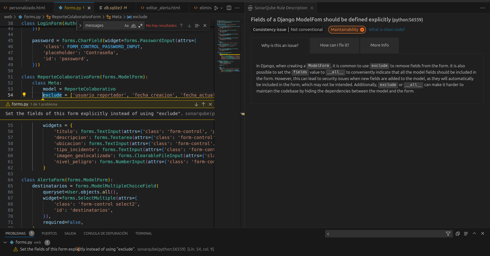
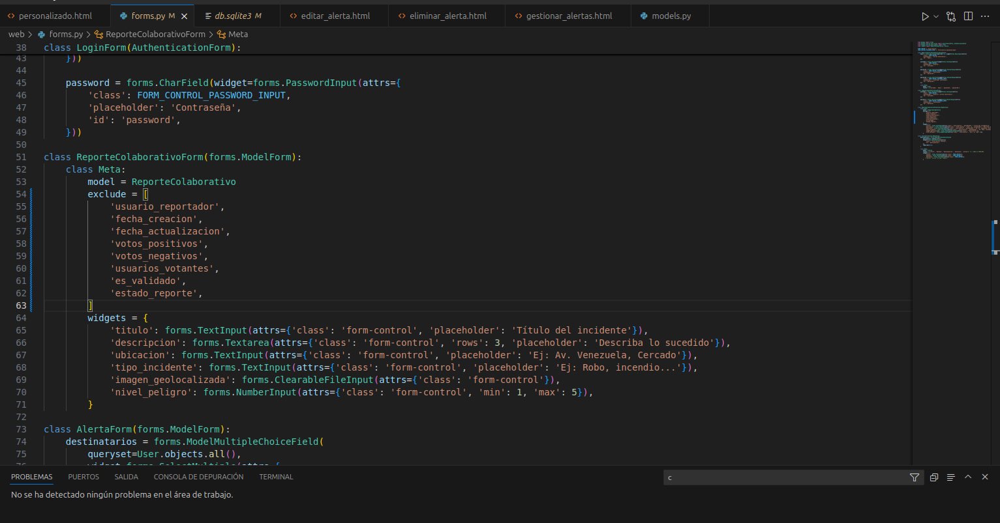
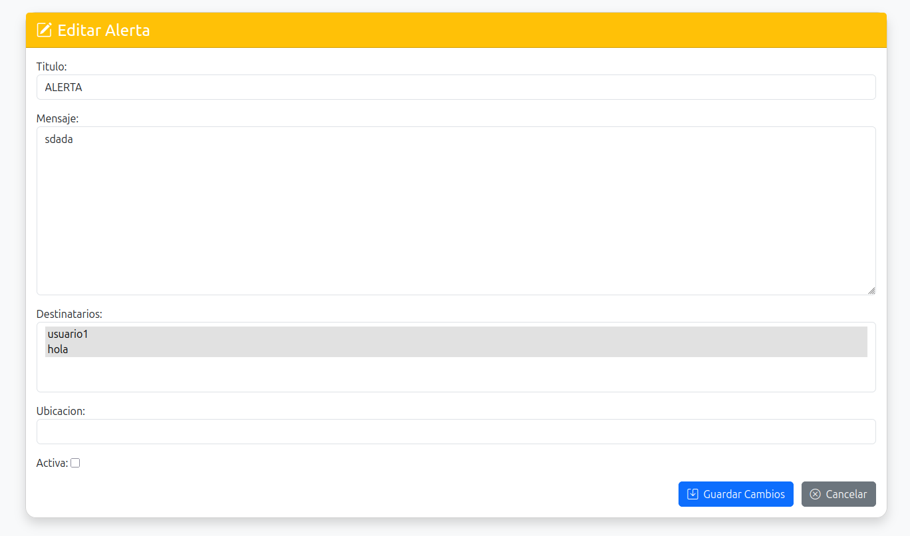
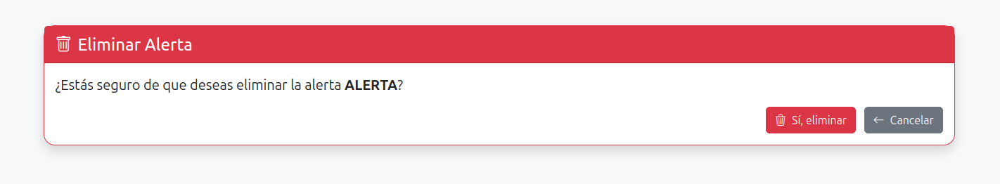
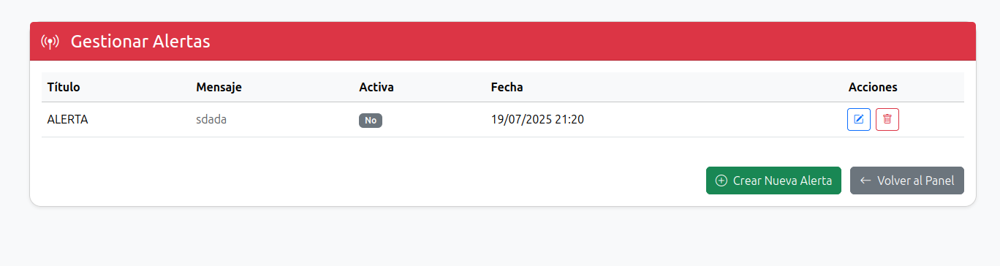
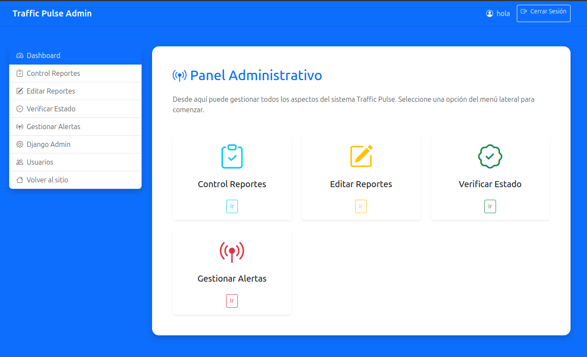

# 🧹 Laboratorio 11: Clean Code - Módulo de Alertas
**📢 Módulo Implementado:** Sistema de Gestión de Alertas

## 🔍 Problemas Identificados y Correcciones Aplicadas

### 1. **📝 NOMBRES - Variables y Constantes**

#### ❌ Problema Original:
```python
# forms.py - Nombres poco descriptivos
FORM_CONTROL = 'form-control'
FORM_CONTROL_PASSWORD_INPUT = 'form-control password-input'
```

#### ✅ Corrección Aplicada:
```python
# forms.py - Nombres más descriptivos y específicos
BOOTSTRAP_FORM_CONTROL_CLASS = 'form-control'
BOOTSTRAP_PASSWORD_INPUT_CLASS = 'form-control password-input'
SELECT2_MULTISELECT_CLASS = 'form-control select2'
```

**💡 Práctica:** Usar nombres que revelen intención y sean específicos al contexto.

---

### 2. **⚙️ FUNCIONES - Responsabilidad Única**

#### ❌ Problema Original:
```python
# views.py (hipotético)
def gestionar_alertas(request):
    # Función que hace demasiadas cosas:
    # - Obtiene alertas
    # - Maneja formularios
    # - Procesa validaciones
    # - Renderiza template
    pass
```

#### ✅ Corrección Aplicada:
```python
# views.py - Separación de responsabilidades
def obtener_alertas_activas():
    """Obtiene únicamente las alertas activas."""
    return Alerta.objects.filter(activa=True).order_by('-fecha_creacion')

def validar_datos_alerta(form_data):
    """Valida específicamente los datos del formulario de alerta."""
    errores = []
    if not form_data.get('titulo'):
        errores.append("El título es obligatorio")
    return errores

def gestionar_alertas(request):
    """Vista principal que coordina las operaciones."""
    alertas = obtener_alertas_activas()
    return render(request, 'gestionar_alertas.html', {'alertas': alertas})
```

**💡 Práctica:** Una función debe hacer una sola cosa y hacerla bien.

---

### 3. **💬 COMENTARIOS - Eliminar Redundantes**

#### ❌ Problema Original:
```python
# models.py
class Alerta(models.Model):
    titulo = models.CharField(max_length=100)  # Campo título
    mensaje = models.TextField()  # Campo para el mensaje
    fecha_envio = models.DateTimeField(auto_now_add=True)  # Fecha de envío
```

#### ✅ Corrección Aplicada:
```python
# models.py - Solo comentarios que aporten valor
class Alerta(models.Model):
    titulo = models.CharField(max_length=100)
    mensaje = models.TextField()
    fecha_envio = models.DateTimeField(auto_now_add=True)
    # Campo añadido para cumplir con requerimientos del template
    fecha_creacion = models.DateTimeField(auto_now_add=True)
    
    def esta_vigente(self):
        """Verifica si la alerta sigue siendo válida basándose en reglas de negocio."""
        from datetime import timedelta
        return self.activa and self.fecha_creacion >= timezone.now() - timedelta(days=30)
```

**💡 Práctica:** Eliminar comentarios obvios, mantener solo los que explican el "por qué".

---

### 4. **🏗️ ESTRUCTURA DE CÓDIGO FUENTE - Organización**

#### ❌ Problema Original:
```python
# forms.py - Campos desordenados y sin agrupación lógica
class AlertaForm(forms.ModelForm):
    destinatarios = forms.ModelMultipleChoiceField(...)
    class Meta:
        model = Alerta
        fields = ['titulo', 'mensaje', 'destinatarios', 'ubicacion', 'activa']
        widgets = {
            'titulo': forms.TextInput(attrs={'class': FORM_CONTROL}),
            'mensaje': forms.Textarea(attrs={'class': FORM_CONTROL}),
        }
```

#### ✅ Corrección Aplicada:
```python
# forms.py - Estructura organizada y consistente
class AlertaForm(forms.ModelForm):
    # Campos personalizados agrupados al inicio
    destinatarios = forms.ModelMultipleChoiceField(
        queryset=User.objects.filter(is_active=True),
        widget=forms.SelectMultiple(attrs={
            'class': SELECT2_MULTISELECT_CLASS,
            'id': 'destinatarios',
        }),
        required=False,
        help_text="Seleccione los usuarios que recibirán la alerta"
    )
    
    class Meta:
        model = Alerta
        # Solo campos que el usuario debe poder modificar
        fields = ['titulo', 'mensaje', 'destinatarios', 'ubicacion']
        widgets = {
            'titulo': forms.TextInput(attrs={
                'class': BOOTSTRAP_FORM_CONTROL_CLASS,
                'placeholder': 'Título de la alerta'
            }),
            'mensaje': forms.Textarea(attrs={
                'class': BOOTSTRAP_FORM_CONTROL_CLASS,
                'rows': 4,
                'placeholder': 'Mensaje de la alerta'
            }),
            'ubicacion': forms.TextInput(attrs={
                'class': BOOTSTRAP_FORM_CONTROL_CLASS,
                'placeholder': 'Ubicación (opcional)'
            }),
        }
    
    def clean_titulo(self):
        """Valida que el título no esté vacío y tenga longitud apropiada."""
        titulo = self.cleaned_data.get('titulo')
        if not titulo or len(titulo.strip()) < 5:
            raise forms.ValidationError("El título debe tener al menos 5 caracteres")
        return titulo.strip()
```

**💡 Práctica:** Agrupar código relacionado y mantener orden lógico.

---

### 5. **📦 OBJETOS/ESTRUCTURA DE DATOS - Encapsulación**

#### ❌ Problema Original:
```python
# models.py - Acceso directo a atributos
class Alerta(models.Model):
    activa = models.BooleanField(default=True)
    # Sin métodos para controlar el estado
```

#### ✅ Corrección Aplicada:
```python
# models.py - Encapsulación adecuada
class Alerta(models.Model):
    titulo = models.CharField(max_length=100)
    mensaje = models.TextField()
    fecha_envio = models.DateTimeField(auto_now_add=True)
    fecha_creacion = models.DateTimeField(auto_now_add=True)
    enviado_por = models.ForeignKey(User, on_delete=models.CASCADE, related_name='alertas_enviadas')
    destinatarios = models.ManyToManyField(User, related_name='alertas_recibidas')
    ubicacion = models.CharField(max_length=200, blank=True, default='')
    _activa = models.BooleanField(default=True, db_column='activa')
    
    @property
    def activa(self):
        """Getter para el estado activa."""
        return self._activa
    
    def activar(self):
        """Activa la alerta de forma controlada."""
        self._activa = True
        self.save(update_fields=['_activa'])
    
    def desactivar(self):
        """Desactiva la alerta de forma controlada."""
        self._activa = False
        self.save(update_fields=['_activa'])
    
    def puede_ser_editada_por(self, usuario):
        """Verifica si un usuario puede editar esta alerta."""
        return usuario == self.enviado_por or usuario.is_staff
    
    def __str__(self):
        return f"{self.titulo} - {self.fecha_envio.strftime('%Y-%m-%d %H:%M')}"
```

**💡 Práctica:** Encapsular datos y proporcionar métodos para manipularlos.

---

### 6. **🚨 TRATAMIENTO DE ERRORES - Manejo Específico**

#### ❌ Problema Original:
```python
# views.py (hipotético) - Sin manejo de errores
def crear_alerta(request):
    form = AlertaForm(request.POST)
    if form.is_valid():
        form.save()
    # Sin manejo de errores específicos
```

#### ✅ Corrección Aplicada:
```python
# views.py - Manejo específico de errores
import logging
from django.contrib import messages
from django.db import transaction, IntegrityError

logger = logging.getLogger(__name__)

def crear_alerta(request):
    """Crea una nueva alerta con manejo robusto de errores."""
    if request.method == 'POST':
        form = AlertaForm(request.POST)
        if form.is_valid():
            try:
                with transaction.atomic():
                    alerta = form.save(commit=False)
                    alerta.enviado_por = request.user
                    alerta.save()
                    form.save_m2m()  # Guarda las relaciones many-to-many
                    
                    messages.success(request, 'Alerta creada exitosamente.')
                    return redirect('gestionar_alertas')
                    
            except IntegrityError as e:
                logger.error(f"Error de integridad al crear alerta: {e}")
                messages.error(request, 'Error en la base de datos. Intente nuevamente.')
            except Exception as e:
                logger.error(f"Error inesperado al crear alerta: {e}")
                messages.error(request, 'Error inesperado. Contacte al administrador.')
        else:
            messages.error(request, 'Por favor corrija los errores en el formulario.')
    else:
        form = AlertaForm()
    
    return render(request, 'crear_alerta.html', {'form': form})
```

**💡 Práctica:** Manejar errores específicos y proporcionar retroalimentación útil.

---

### 7. **🏛️ CLASES - Principio de Responsabilidad Única**

#### ❌ Problema Original:
```python
# forms.py - Clases con múltiples responsabilidades mezcladas
class AlertaForm(forms.ModelForm):
    # Mezcla validación, presentación y lógica de negocio
```

#### ✅ Corrección Aplicada:
```python
# forms.py - Separación clara de responsabilidades
class BaseAlertaForm(forms.ModelForm):
    """Formulario base para alertas con validaciones comunes."""
    
    class Meta:
        model = Alerta
        fields = ['titulo', 'mensaje', 'ubicacion']
    
    def clean_titulo(self):
        titulo = self.cleaned_data.get('titulo')
        if not titulo or len(titulo.strip()) < 5:
            raise forms.ValidationError("El título debe tener al menos 5 caracteres")
        return titulo.strip()

class AlertaAdminForm(BaseAlertaForm):
    """Formulario específico para administradores con campos adicionales."""
    
    destinatarios = forms.ModelMultipleChoiceField(
        queryset=User.objects.filter(is_active=True),
        required=False
    )
    
    class Meta(BaseAlertaForm.Meta):
        fields = BaseAlertaForm.Meta.fields + ['destinatarios']

class AlertaUsuarioForm(BaseAlertaForm):
    """Formulario simplificado para usuarios regulares."""
    
    class Meta(BaseAlertaForm.Meta):
        widgets = {
            'titulo': forms.TextInput(attrs={'class': 'form-control'}),
            'mensaje': forms.Textarea(attrs={'class': 'form-control', 'rows': 3}),
        }
```

**💡 Práctica:** Una clase debe tener una sola razón para cambiar.

---

## 🦨 Code Smells Corregidos

### 1. **📋 Long Parameter List**
- **❌ Antes:** Funciones con muchos parámetros
- **✅ Después:** Uso de objetos y configuraciones

### 2. **🔄 Duplicate Code**
- **❌ Antes:** Clases CSS repetidas en múltiples lugares
- **✅ Después:** Constantes reutilizables

### 3. **💀 Dead Code**
- **❌ Antes:** Campo 'activa' en widgets pero removido de fields
- **✅ Después:** Consistencia entre fields y widgets

## 📊 Análisis Estático con SonarQube

Durante la implementación del módulo de gestión de alertas, se utilizó **SonarQube** como herramienta de análisis estático para detectar **bugs**, **code smells** y **vulnerabilidades** en tiempo real.

### 🛠️ Herramienta utilizada:
- **Extensión:** SonarQube
- **IDE:** Visual Studio Code

---

### 🐞 Problema Detectado

#### 🔍 Descripción:
Uso de nombres poco descriptivos en constantes, lo cual generaba un **code smell** del tipo *Too long statement*.

#### 📸 Captura del problema detectado:


#### 📸 Captura del problema detectado:


### 📌 Enlace del Proyecto

- **🗂️ Enlace de Trello:**  
  [➡️ Ir al tablero de Trello](https://trello.com/c/tG4svkDb)

### 📋 Estado de Tareas

- ✅ **Gestión de Alertas** - COMPLETADO

## 🎨 Templates Implementados

### crear_alerta.html


---

### editar_alerta.html


---

### eliminar_alerta.html


---

### gestionar_alertas.html


---

### dashboard.html


