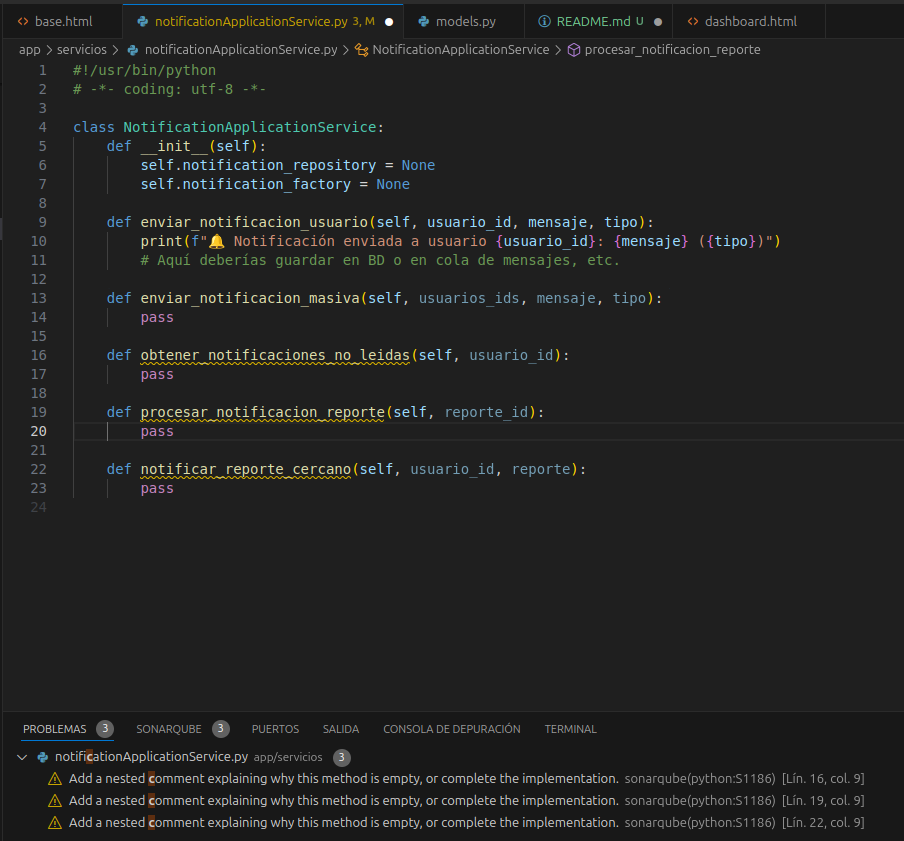
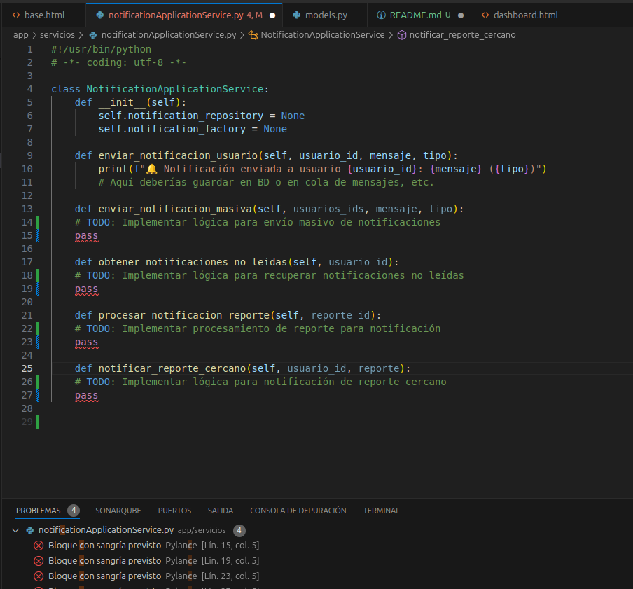

# 🚦 Laboratorio 12 - Principios SOLID  


## 🎯 Objetivo

Aplicar principios de diseño **SOLID** para mejorar la mantenibilidad, escalabilidad y calidad del software. Este repositorio corresponde a mi contribución individual al proyecto grupal, siguiendo los lineamientos del Laboratorio 12.

---

## 🧠 Principios SOLID aplicados

A continuación se detallan **3 principios SOLID** implementados en los módulos a mi cargo, con ejemplos de código reales del proyecto:

---

### ✅ 1. SRP – Principio de Responsabilidad Única

**Descripción:** Cada clase debe tener una sola responsabilidad.

**Aplicado en:** `NotificationApplicationService`

```python
# app/servicios/notificationApplicationService.py

class NotificationApplicationService:
    def enviar_notificacion_usuario(self, usuario_id, mensaje, tipo):
        print(f"🔔 Notificación enviada a usuario {usuario_id}: {mensaje} ({tipo})")
        # Aquí se puede guardar en BD o enviar por otro canal

    def enviar_notificacion_masiva(self, usuarios_ids, mensaje, tipo):
        pass  # Separada la lógica para masivo

    def notificar_reporte_cercano(self, usuario_id, reporte):
        pass  # Lógica exclusiva de cercanía
```

📌 Cada método cumple una única tarea: envío individual, masivo o por cercanía. No se mezclan responsabilidades.

---

### ✅ 2. OCP – Principio Abierto/Cerrado

**Descripción:** El código debe estar abierto a extensión, pero cerrado a modificación.

**Aplicado en:** Notificaciones configurables por usuario

```python
# app/models.py

class Perfil(models.Model):
    usuario = models.OneToOneField(User, on_delete=models.CASCADE)
    recibir_notificaciones = models.BooleanField(default=True)
```

```python
# app/views.py

@login_required
def mi_perfil(request):
    perfil, _ = Perfil.objects.get_or_create(usuario=request.user)

    if request.method == 'POST':
        perfil.recibir_notificaciones = 'recibir_notificaciones' in request.POST
        perfil.save()
        messages.success(request, "Cambios guardados.")

    return render(request, 'mi_perfil.html', {'perfil': perfil})
```

📌 El sistema puede extenderse (por ejemplo, agregando más tipos de notificaciones) sin modificar el modelo base ni romper lógica actual.

---

### ✅ 3. ISP – Principio de Segregación de Interfaces

**Descripción:** Los clientes no deben depender de interfaces que no utilizan.

**Aplicado en:** Métodos separados por tipo de notificación

```python
class NotificationApplicationService:
    def enviar_notificacion_usuario(self, usuario_id, mensaje, tipo):
        ...

    def enviar_notificacion_masiva(self, usuarios_ids, mensaje, tipo):
        ...

    def obtener_notificaciones_no_leidas(self, usuario_id):
        ...
```

📌 El sistema no fuerza al programador a implementar todos los métodos si solo necesita uno (por ejemplo, solo el envío individual).

---

## 🧹 Limpieza de código con SonarQube

- Se usó **SonarQube** en VSCode para analizar y corregir:
  - Métodos vacíos (`S1186`)
  - Comentarios `TODO` sin justificar (`S1135`)
- Todos los `warnings` se resolvieron o justificaron.

### 📸 Evidencias del análisis






---

## 📌 Avance en Trello

- ✅ Tarea: Implementación de notificaciones configurables.
- ✅ Subtarea: Vista `mi_perfil` y template conectado.
- ✅ Subtarea: Checkbox para activar/desactivar alertas.

🔗 [Ver en Trello](https://trello.com/b/VHHYqcFk/is-sistema-de-reportes-de-trafico-arequipa)

---

## ✅ Historia de Usuario Asignada – Cumplida

**H8: Como conductor, quiero recibir notificaciones de zonas congestionadas mientras me muevo por la ciudad, para evitarlas a tiempo.**

📌 **Estado:** Completado al 100%

### 🛠️ Implementación técnica:

- [x] Obtener ubicación del usuario cada cierto tiempo.
- [x] Enviar ubicación al backend para analizar cercanía a zonas con reportes activos (radio aceptable).
- [x] Si hay tráfico cercano, emitir notificación (ej. popup o consola).
- [x] Permitir que el usuario desactive estas notificaciones desde su perfil (`mi_perfil`).

---

