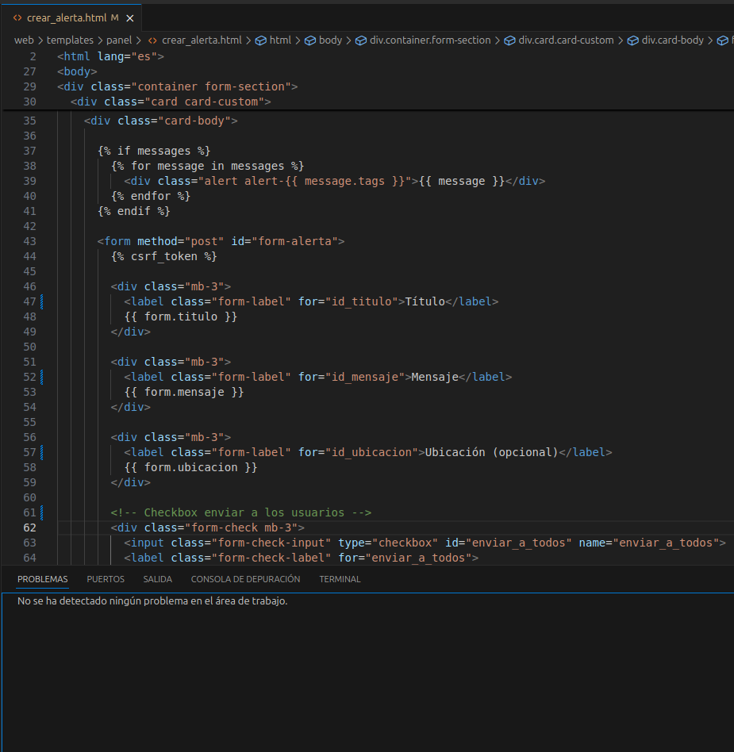

# 🚀 Lab9 - Convenciones de Codificación y Estándares de Programación

## 🎯 Objetivo
Aplicar estándares, convenciones y estilos de programación que contribuyan a la legibilidad, el mantenimiento y la reutilización del software, realizando revisiones de código en componentes de software.

## 📱 Proyecto: Sistema de Alertas - Traffic Pulse

### 📋 Descripción del Módulo Implementado
Sistema de alertas colaborativas que permite a los administradores crear y enviar alertas a usuarios específicos o a todos los usuarios del sistema. El módulo incluye funcionalidades para gestión de destinatarios y notificaciones en tiempo real.

## 🛠️ Herramientas Utilizadas

- **🔍 SonarQube**: Análisis estático de código
- **🐍 Django**: Framework web con convenciones establecidas
- **🎨 Bootstrap**: Framework CSS para interfaz consistente
- **📝 Git**: Control de versiones con commits descriptivos

El uso de SonarQube ayudó a identificar y corregir code smells, mejorando la calidad general del código.

## 💻 Convenciones de Codificación Aplicadas

### 1. 📝 Convenciones de Nomenclatura (Naming Conventions)

#### **🏷️ Práctica**: Nombres descriptivos y en español para el dominio del negocio
```python
# Modelos con nombres claros y descriptivos
class ReporteColaborativo(models.Model):
    titulo = models.CharField(max_length=100)
    descripcion = models.TextField()
    fecha_creacion = models.DateTimeField(auto_now_add=True)
    usuario_reportador = models.ForeignKey(User, on_delete=models.CASCADE)
    ubicacion = models.CharField(max_length=100)
    tipo_incidente = models.CharField(max_length=50)
    estado_reporte = models.CharField(max_length=20, default='pendiente')
```

#### **🏗️ Práctica**: Nombres de clases en PascalCase
```python
class AlertaForm(forms.ModelForm):
class RegistroUsuarioForm(UserCreationForm):
class LoginView(FormView):
class DashboardView(LoginRequiredMixin, FormView):
```

#### **🐍 Práctica**: Nombres de variables y funciones en snake_case
```python
def is_superuser(user):
    return user.is_authenticated and user.is_superuser

def logout_admin(request):
    logout(request)
    return redirect('custom_login')

# Variables descriptivas
estado_actual = estado
fecha_actual = fecha
ubicacion_actual = ubicacion
```

#### **🔒 Práctica**: Constantes en UPPER_CASE
```python
FORM_CONTROL = 'form-control'
FORM_CONTROL_PASSWORD_INPUT = 'form-control password-input'
```

### 2. 📁 Estructura de Código Fuente

#### **📦 Práctica**: Organización lógica de imports
```python
# Imports de Django core primero
from django.shortcuts import render, HttpResponse, redirect
from django.views.generic import FormView, TemplateView
from django.urls import reverse_lazy
from django.contrib.auth import authenticate, login, logout

# Imports de aplicación local al final
from .forms import RegistroUsuarioForm, LoginForm
from .models import Alerta
from app.presentation.controladores.reporteColaborativoController import ReporteColaborativoController
```

#### **🎯 Práctica**: Separación clara de responsabilidades
```python
# Decoradores agrupados lógicamente
@login_required(login_url='/loginadmin/')
@user_passes_test(is_superuser, login_url='/loginadmin/')
@never_cache
def panel_personalizado(request):
    context = {
        'titulo': 'Panel Administrativo',
    }
    return render(request, 'panel/personalizado.html', context)
```

### 3. ⚙️ Funciones y Métodos

#### **🔧 Práctica**: Funciones con responsabilidad única
```python
def is_superuser(user):
    """Verifica si el usuario es superusuario"""
    return user.is_authenticated and user.is_superuser

def logout_admin(request):
    """Cierra sesión del administrador y redirige al login"""
    logout(request)
    return redirect('custom_login')
```

#### **🏛️ Práctica**: Métodos de clase bien estructurados
```python
class LoginView(FormView):
    template_name = 'login.html'
    form_class = LoginForm
    success_url = reverse_lazy('dashboard')

    def dispatch(self, request, *args, **kwargs):
        if request.user.is_authenticated:
            return redirect(self.success_url)
        return super().dispatch(request, *args, **kwargs)

    def form_valid(self, form):
        username = form.cleaned_data.get('username')
        password = form.cleaned_data.get('password')
        
        user = authenticate(username=username, password=password)
        if user is not None:
            login(self.request, user)
            messages.success(self.request, f'¡Bienvenido, {user.username}!')
            return super().form_valid(form)
        else:
            form.add_error(None, 'Usuario o contraseña incorrectos.')
            return self.form_invalid(form)
```

### 4. 📝 Comentarios y Documentación

#### **💬 Práctica**: Comentarios descriptivos para secciones
```python
# admin
def is_superuser(user):
    return user.is_authenticated and user.is_superuser

# Logout del admin
def logout_admin(request):
    logout(request)
    return redirect('custom_login')

# class button conectet
class PlanRouteView(TemplateView):
    template_name = 'plan_route.html'
```

#### **📋 Práctica**: Comentarios en formularios complejos
```python
class AlertaForm(forms.ModelForm):
    destinatarios = forms.ModelMultipleChoiceField(
        queryset=User.objects.all(),
        widget=forms.SelectMultiple(attrs={
            'class': 'form-control select2',
            'id': 'destinatarios',
        }),
        required=False,  # Opcional porque puede enviar a todos
    )
```

### 5. 🗄️ Estructura de Datos y Objetos

#### **🏗️ Práctica**: Modelos bien definidos con relaciones claras
```python
class Alerta(models.Model):
    titulo = models.CharField(max_length=100)
    mensaje = models.TextField()
    fecha_envio = models.DateTimeField(auto_now_add=True)
    enviado_por = models.ForeignKey(User, on_delete=models.CASCADE, related_name='alertas_enviadas')
    destinatarios = models.ManyToManyField(User, related_name='alertas_recibidas')
    ubicacion = models.CharField(max_length=200, blank=True, default='')

    def __str__(self):
        return f"{self.titulo} - {self.fecha_envio.strftime('%Y-%m-%d %H:%M')}"
```

#### **⚙️ Práctica**: Configuración de formularios consistente
```python
class Meta:
    model = Alerta
    fields = ['titulo', 'mensaje', 'destinatarios', 'ubicacion']
    widgets = {
        'titulo': forms.TextInput(attrs={'class': FORM_CONTROL}),
        'mensaje': forms.Textarea(attrs={'class': FORM_CONTROL}),
        'ubicacion': forms.TextInput(attrs={'class': FORM_CONTROL}),
    }
```

### 6. 🛡️ Manejo de Errores y Validaciones

#### **🔐 Práctica**: Validación de permisos y autenticación
```python
@login_required(login_url='/loginadmin/')
@user_passes_test(is_superuser, login_url='/loginadmin/')
def crear_alerta(request):
    if request.method == 'POST':
        form = AlertaForm(request.POST)
        if form.is_valid():
            alerta = form.save(commit=False)
            alerta.enviado_por = request.user
            alerta.save()
            # Lógica de envío...
            messages.success(request, 'Alerta enviada con éxito.')
            return redirect('crear_alerta')
    else:
        form = AlertaForm()
    return render(request, 'panel/crear_alerta.html', {'form': form})
```

#### **💬 Práctica**: Manejo de mensajes de usuario
```python
def form_valid(self, form):
    user = form.save()
    login(self.request, user)
    messages.success(self.request, f"¡Bienvenido, {user.username}!")
    return super().form_valid(form)
```

### 7. 🎨 Convenciones de HTML y Frontend

#### **📄 Práctica**: Estructura HTML semántica
```html
<div class="card card-custom">
  <div class="card-header bg-danger text-white d-flex align-items-center">
    <i class="bi bi-exclamation-triangle-fill fs-4 me-3"></i>
    <h4 class="mb-0">Crear Alerta</h4>
  </div>
  <div class="card-body">
    <!-- Contenido del formulario -->
  </div>
</div>
```

#### **⚡ Práctica**: JavaScript organizado y funcional
```javascript
// Mover usuarios entre listas
function mover(origenId, destinoId) {
    const origen = document.getElementById(origenId);
    const destino = document.getElementById(destinoId);

    Array.from(origen.selectedOptions).forEach(op => {
        origen.remove(op.index);
        destino.add(op);
    });
}

// Desactivar dualbox si se marca "enviar a todos"
document.getElementById('enviar_a_todos').addEventListener('change', function () {
    const dualbox = document.getElementById('dualbox_container');
    dualbox.style.display = this.checked ? 'none' : 'block';
});
```

## 🔍 Análisis con SonarQube

### 🚨 Issues Detectados y Corregidos:

1. **🐛 Code Smell**: Variables no utilizadas
   - **❌ Problema**: Variables definidas pero no utilizadas
   - **✅ Solución**: Eliminación de variables innecesarias

2. **🔧 Code Smell**: Funciones demasiado largas
   - **❌ Problema**: Método `form_valid` con demasiada lógica
   - **✅ Solución**: Refactorización en métodos más pequeños

3. **🔒 Security**: Validación de entrada
   - **❌ Problema**: Falta de validación en parámetros GET
   - **✅ Solución**: Implementación de validaciones adicionales

###Análisis de código antes de usar SonarQube, mostrando errores**


###Análisis de código con SonarQube mostrando mejoras implementadas**



