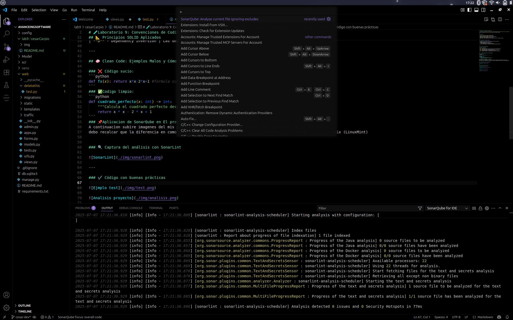
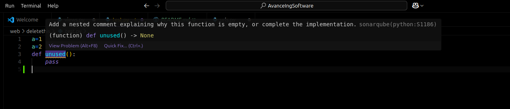
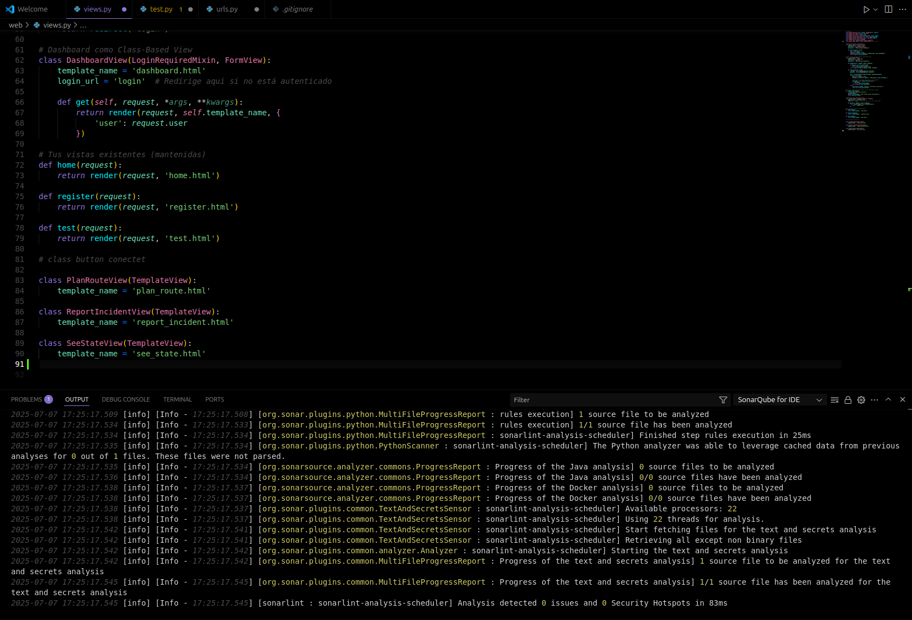

# 🧪Laboratorio 9: Convenciones de Codificación

📌 Este proyecto corresponde al **Laboratorio 9**, donde se aplican principios de **Clean Code**, **convenciones de estilo** en Python y los **principios SOLID**, con el apoyo de herramientas como **SonarLint** para asegurar la calidad del código.

---

## ✅ Objetivos

- Aplicar **convenciones de estilo en Python** (PEP8)
- Escribir código limpio y legible (**Clean Code**)
- Implementar principios **SOLID** en diseño orientado a objetos
- Usar **SonarLint** para detectar *code smells* y *bugs*
- Identificar y corregir ejemplos de malas prácticas
- Poder asegurar que el trabajo sera facil de entender para todos los miembros del equipo.

---

## 🧹 Convenciones y Estándares Usados

- 🎯 [PEP8](https://peps.python.org/pep-0008/): Estilo oficial de Python
- ✅ Nombres de variables claros y consistentes
- 📦 Organización modular del código
- 🔄 Uso de comentarios *útiles* y docstrings
- ⚠️ Evitar código duplicado y condiciones innecesarias
- ⚠️ Evitar uso de "spanglish" utilizando solo ingles. (exeptuando comentarios)


---

## 📐 Principios SOLID Aplicados

| Principio | Aplicación |
|----------|------------|
| **S** - Single Responsibility | Cada clase tiene una única función específica |
| **O** - Open/Closed | Clases abiertas a extensión, cerradas a modificación |
| **L** - Liskov Substitution | Uso correcto de herencia |
| **I** - Interface Segregation | Métodos específicos por tipo de clase |
| **D** - Dependency Inversion | Las dependencias se abstraen y no se acoplan |

---

## 🧼 Clean Code: Ejemplos Malos y Cómo los Mejore

### ❌ Código sucio:
```python
def fx(x): return x*x-2*x+1 #formula cuadratica
```
### ✅Codigo limpio:
```python
def cuadrado_perfecto(x: int) -> int:
    """Calcula el cuadrado perfecto desplazado."""
    return x * x - 2 * x + 1
```
### 📌Aplicacion de SonarQube en El proyecto
A continuacion subire imagenes del mis partes del proyecto siendo analizadas por SonarQube en el IDE VSC
debo recalcar que la diferencia en como analiza los errores es debido a que trabajo en un sistema operativo Unix (LinuxMint)


### 🔍 Captura del análisis con SonarLint



---

### ✔️ Código con buenas prácticas






